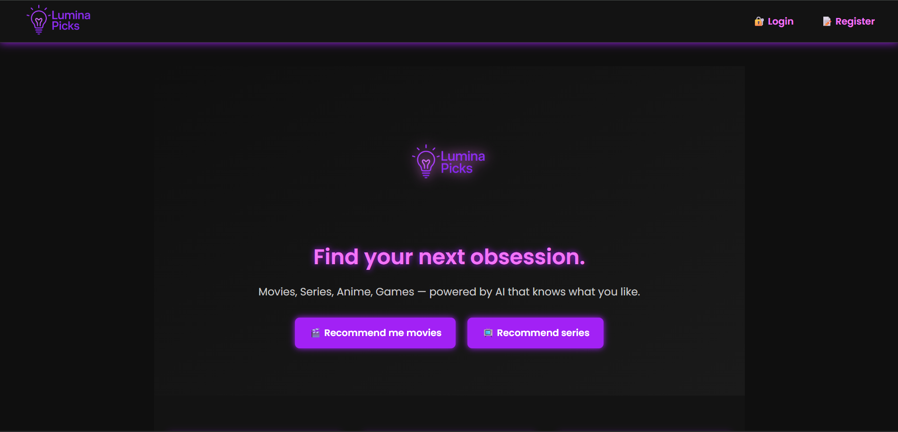
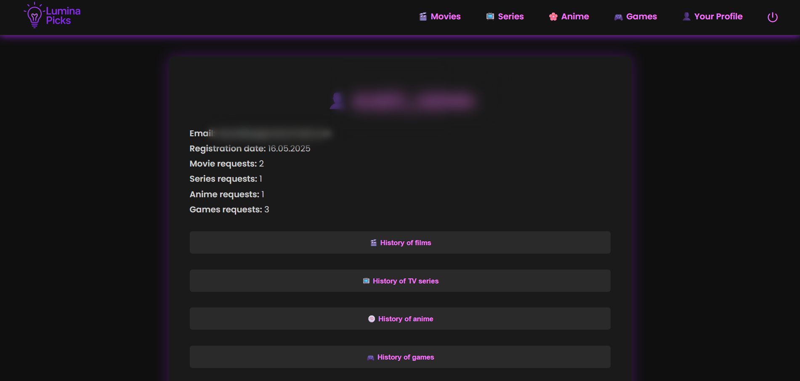
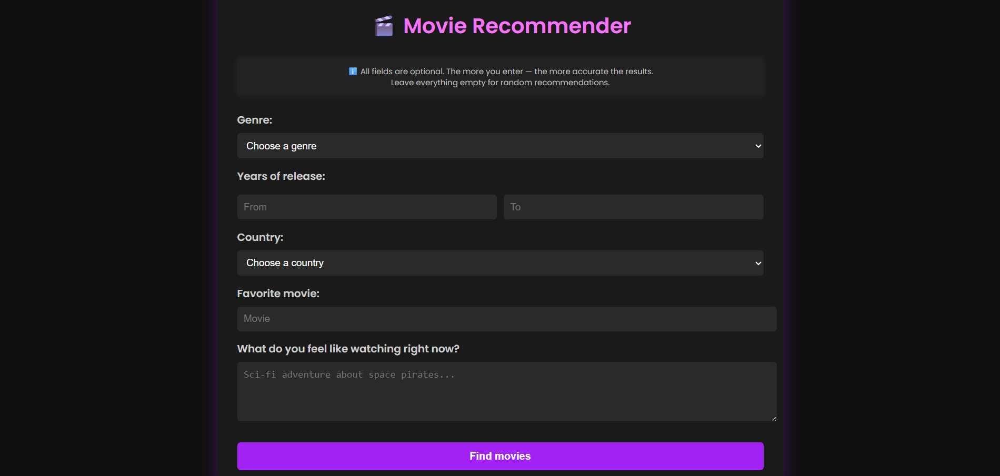
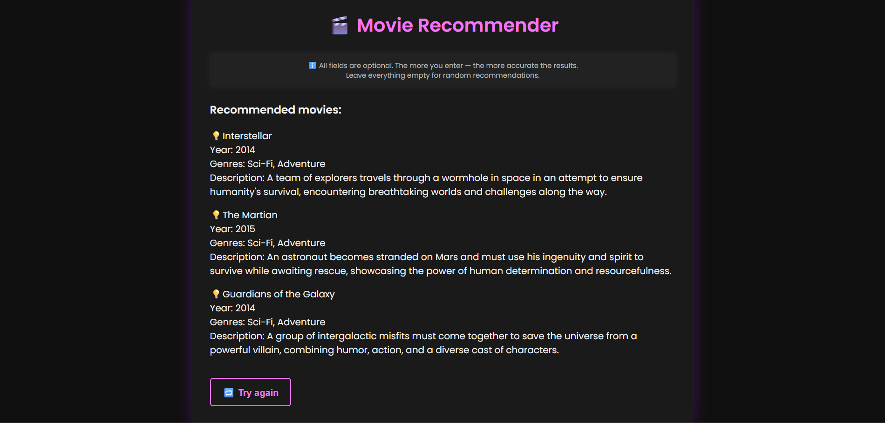

<p align="center">
  
</p>

<h1 align="center">LuminaPicks</h1>
<p align="center"><em>Find your next obsession — AI picks for movies, series, anime & games.</em></p>

<p align="center">
  <a href="https://luminapicks.up.railway.app">
    
  </a>
  <a href="LICENSE">
    
  </a>
</p>

---

▶️ **Demo:** <https://luminapicks.up.railway.app>

<details>
  <summary>Show screenshots</summary>

  <p align="center">
    
    
    
    
  </p>

</details>

---

## Features
- 🎯 **Personalised AI picks** — tailored recommendations for movies, series, anime & games  
- 🌐 **Web UI + REST API** — one codebase, two ways to use it  
- 🔐 **Secure by design** — JWT, email verification, reCAPTCHA  
- 🐳 **Docker-first** — `docker compose up --build` and you’re ready  
- 🚀 **Cloud-ready** — already running on Railway

---

## Quick Start

```bash
git clone https://github.com/andwellbas/contentlumina.git
cd contentlumina
cp .env.example .env    # enter SECRET_KEY, OPENAI_API_KEY, etc.
docker compose up --build
```

Web UI will be on **http://localhost:8000**, API — on **/api/**.

---

## Tech Stack

| Layer | Tech | Purpose |
|-----|----------------|--------|
| Backend | Django 5.2 · DRF 3.16 | Core site & JSON API |
| Auth | drf-simplejwt | Login, refresh tokens |
| AI | OpenAI Python SDK | GPT queries for content recommendations |
| DB | PostgreSQL · dj-database-url | Production DB + simple connection via env |
| DevOps | Docker / compose · Gunicorn · WhiteNoise · Railway | Containers, production-WSGI, statics, hosting |
| Env | python-decouple · dotenv | Reading secrets from `.env` |

---

## REST API

| Endpoint | Method | Description |
|----------|--------|------|
| `/api/register/` | POST | Create user |
| `/api/login/` | POST | Get JWT pair |
| `/api/token/refresh/` | POST | Refresh access token |
| `/api/generate/` | POST | Generate AI description/recommendation |

---

## License
Released under the **MIT** License — see [`LICENSE`](LICENSE).

---

## Contact
Basanet Andrii — <basanetand@gmail.com>

---
